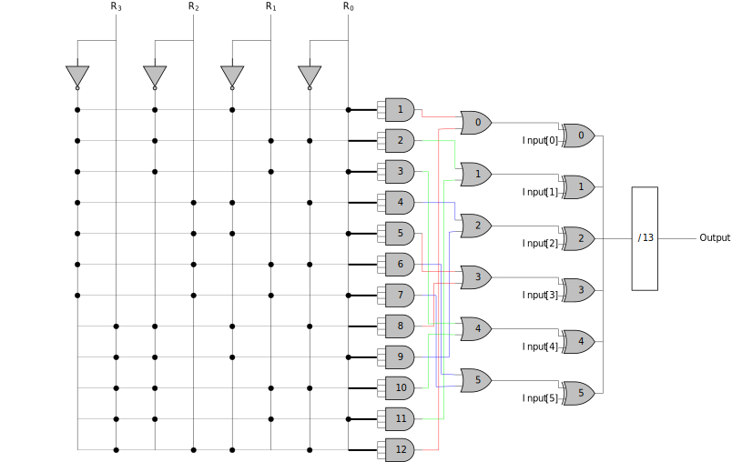

# Latex

* 1. [Miktex](https://miktex.org/)
* 2. [Texmaker](https://www.xm1math.net/texmaker/)

## tikz ---> svg
* tex file use ``` \documentclass[tikz, margin=3pt, dvisvgm]{standalone} ```

* 1. 開啟 CMD
* 2. 到目錄下
	* 編輯，輸出xdv
	* > xelatex -no-pdf `file name`
	* 輸出svg
	* > dvisvgm --zoom=-1 --exact --font-format=woff `file name`.xdv
* svg fig
	* 我自己的範例:
</br></br>

<table align="center">
  <tr>
    <td><a href="https://github.com/Wilhelmine21">Home</a></td>
    <td><a href="https://github.com/Wilhelmine21/LaTeX-tikz#latex">TOP</a></td>
    <td><a href="https://github.com/Wilhelmine21/LaTeX-Beamer-PPT#how-to-create-a-ppt-using-latex">LaTeX-Beamer-PPT</a></td>
  </tr>
</table>

	
